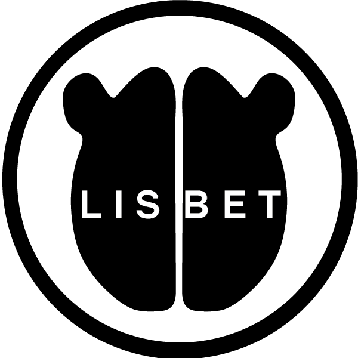

<div align="center">

<p align="center">
  
</p><br>

[📚 Documentation](https://docs.lisbet.ai) |
[📦 Install](https://docs.lisbet.ai/getting_started.html#installation) |
[🚀 Quickstart](https://docs.lisbet.ai/getting_started.html) |
[🪲 Reporting Issues](https://github.com/BelloneLab/lisbet/issues)
[📧 Contact](https://lisbet.ai/contact/)

[](https://pypi.org/project/lisbet/)
[]()
[](https://doi.org/10.48550/arXiv.2311.04069)

</div>

## About LISBET
LISBET (LISBET Is a Social BEhavior Transformer) is a machine learning model for social behavior discovery and classification.

> [!WARNING]
> LISBET is currently under development and the interface is subject to change.

## Installation
See the [installation guide](https://docs.lisbet.ai/getting_started.html) for a step-by-step guide on how to install LISBET.

## Citing LISBET
If you use LISBET in your research, please cite the following paper:

```bibtex
@misc{chindemi2023lisbet,
  title={LISBET: a machine learning model for the automatic segmentation of social behavior motifs},
  author={Giuseppe Chindemi and Benoit Girard and Camilla Bellone},
  year={2023},
  eprint={2311.04069},
  archivePrefix={arXiv},
  primaryClass={cs.CV}
}
```
