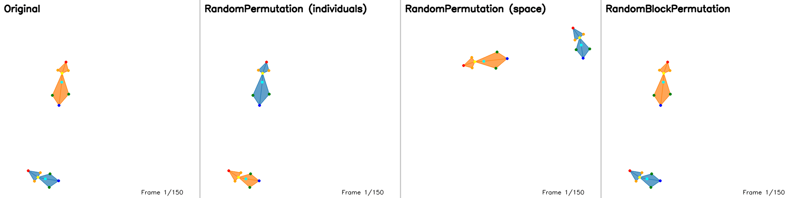

.. _data_augmentation:

Data augmentation
=================

Data augmentation can improve model robustness and generalization by introducing variations during training.
LISBET supports several augmentation techniques that can be combined and applied with configurable probabilities.

   **Visual comparison of data augmentation effects.** From left to right: Original sequence, RandomPermutation (individuals) showing identity swapping with color changes, RandomPermutation (space) showing x/y coordinate swapping, and RandomBlockPermutation showing identity swapping within a temporal block.

Available augmentation techniques
---------------------------------

* **all_perm_id**: Randomly permute individual identities across all frames in a window
    - Use this to make the model invariant to individual labels (e.g., "mouse1" vs "mouse2")
    - Particularly useful for self-supervised tasks where identity labels are arbitrary
    - See the visualization above (second panel) for an example of identity permutation

* **all_perm_ax**: Randomly permute spatial axes (x, y, z) across all frames in a window
    - Use this to make the model invariant to coordinate system orientation
    - **⚠️ Important**: Only suitable for top-down view datasets (typical laboratory setups)
    - **Not recommended** for front-view, side-view, or 3D datasets where axes have semantic meaning
    - See the visualization above (third panel) for an example of spatial axis permutation

* **blk_perm_id**: Randomly permute individual identities within a contiguous block of frames
    - Creates temporal identity confusion within part of the window
    - More challenging augmentation than ``all_perm_id``
    - Requires ``frac`` parameter to specify the fraction of frames to permute
    - See the visualization above (fourth panel) for an example of block permutation

* **gauss_jitter**: Inject sparse Gaussian coordinate noise
    - Per-element Bernoulli(p) over (frame, keypoint, individual) selects positions to jitter
    - Adds zero-mean Gaussian noise with standard deviation ``sigma`` (default 0.01)
    - Robustifies against sporadic tracking jitter / keypoint mislocalization
    - Coordinates are clamped to [0, 1] after noise

* **blk_gauss_jitter**: Inject temporally clustered Gaussian noise (element blocks)
    - Bernoulli(p) over (frame, keypoint, individual) selects *start elements*; each start activates a block of length ``int(frac * window)`` (default frac=0.05) for that keypoint & individual only
    - Noise confined to selected element across subsequent frames; overlapping blocks (same element or different) merge naturally
    - Simulates localized bursts of degraded tracking quality (e.g., one limb jittering)
    - Debug log emitted when overlapping element blocks are detected

* **kp_ablation**: Randomly set keypoint coordinates to NaN (missing data simulation)
    - Per-element Bernoulli(p) over (frame, keypoint, individual) selects positions to ablate
    - Sets all spatial coordinates (x, y, z) to NaN for selected elements
    - Simulates missing or occluded keypoints commonly occurring in real tracking data
    - Helps models become robust to incomplete data / tracking failures
    - Recommended p values: 0.01–0.1 depending on desired robustness level

* **blk_kp_ablation**: Set keypoint coordinates to NaN within temporal blocks
    - Bernoulli(p) over (frame, keypoint, individual) selects *start elements*; each start activates a block of length ``int(frac * window)`` (default frac=0.1) for that keypoint & individual only
    - All spatial coordinates set to NaN within selected blocks
    - Simulates sustained occlusion or tracking loss (e.g., animal behind object, marker occlusion)
    - Overlapping blocks (same element or different) merge naturally
    - Recommended initial values: p≈0.02–0.05 with frac≈0.1–0.2
    - Debug log emitted when overlapping element blocks are detected

Usage examples
--------------

.. note::
    Use the ``--data_augmentation=`` format (with equals sign) to clearly separate the argument from its value. While this makes quoting optional in most shells, it's still recommended for consistency and to prevent any potential shell interpretation of special characters (commas, colons).

**Basic usage with default probability (1.0):**

.. code-block:: console

    $ betman train_model \
        --data_augmentation="all_perm_id" \
        ... # other parameters

**With custom probability:**

.. code-block:: console

    $ betman train_model \
        --data_augmentation="all_perm_id:p=0.5" \
        ... # other parameters

This applies identity permutation to 50% of training samples.

**Multiple augmentations:**

.. code-block:: console

    $ betman train_model \
        --data_augmentation="all_perm_id:p=0.5,all_perm_ax:p=0.7" \
        ... # other parameters

**Gaussian jitter (sparse) + permutation:**

.. code-block:: console

    $ betman train_model \
        --data_augmentation="all_perm_id:p=0.5,gauss_jitter:p=0.02:sigma=0.01" \
        ... # other parameters

**Block jitter (bursts) example:**

.. code-block:: console

    $ betman train_model \
        --data_augmentation="blk_gauss_jitter:p=0.05:sigma=0.02:frac=0.1" \
        ... # other parameters

**Combined full pipeline:**

.. code-block:: console

    $ betman train_model \
        --data_augmentation="all_perm_id:p=0.5,blk_perm_id:p=0.3:frac=0.2,gauss_jitter:p=0.02:sigma=0.01,blk_gauss_jitter:p=0.05:sigma=0.02:frac=0.1" \
        ... # other parameters

**Keypoint ablation (sparse missing data):**

.. code-block:: console

    $ betman train_model \
        --data_augmentation="kp_ablation:p=0.05" \
        ... # other parameters

This randomly sets 5% of keypoint coordinates to NaN (missing), simulating sporadic occlusions.

**Block keypoint ablation (sustained occlusion):**

.. code-block:: console

    $ betman train_model \
        --data_augmentation="blk_kp_ablation:p=0.03:frac=0.15" \
        ... # other parameters

This creates temporal blocks where keypoints are missing, simulating sustained tracking loss.

**Combined augmentation pipeline with ablation:**

.. code-block:: console

    $ betman train_model \
        --data_augmentation="all_perm_id:p=0.5,kp_ablation:p=0.03,blk_kp_ablation:p=0.02:frac=0.1" \
        ... # other parameters

**Block permutation with fraction:**

.. code-block:: console

    $ betman train_model \
        --data_augmentation="blk_perm_id:p=0.3:frac=0.2" \
        ... # other parameters

This applies identity permutation to a random 20% block of frames, with 30% probability.

**Combined augmentations for top-down view datasets:**

.. code-block:: console

    $ betman train_model \
        -v \
        --task_ids=cons,order,shift,warp \
        --data_augmentation="all_perm_id:p=0.5,all_perm_ax:p=0.7,blk_perm_id:p=0.3:frac=0.2" \
        --data_format=movement \
        --run_id=lisbet64x8-calms21U-aug \
        --seed=1234 \
        --epochs=100 \
        --emb_dim=64 \
        --num_layers=8 \
        --num_heads=8 \
        --hidden_dim=256 \
        --train_sample=0.05 \
        --save_history \
        datasets/CalMS21/unlabeled_videos

Important considerations
~~~~~~~~~~~~~~~~~~~~~~~~

* **View-dependent augmentations**: The ``all_perm_ax`` augmentation assumes symmetry across spatial axes and should only be used for top-down view datasets common in laboratory mouse experiments. For human datasets or non-overhead camera angles, this augmentation may hurt performance as axes have semantic meaning (e.g., up/down gravity, left/right lateral).

* **Task compatibility**: Identity permutations (``all_perm_id``, ``blk_perm_id``) are most beneficial for self-supervised tasks and datasets where individual identities are interchangeable.

* **Probability tuning**: Start with moderate probabilities (0.3-0.7) and adjust based on validation performance. Higher probabilities increase variability but may make training less stable.
    - For jitter augmentations, recommended initial values: ``gauss_jitter`` p≈0.01–0.05, ``blk_gauss_jitter`` p≈0.02 with frac≈0.05–0.15.
    - Increase ``sigma`` gradually (e.g., 0.005 → 0.02) monitoring degradation in dev metrics.
    - For ablation augmentations, recommended initial values: ``kp_ablation`` p≈0.01–0.05, ``blk_kp_ablation`` p≈0.02–0.05 with frac≈0.1–0.2.
    - Higher ablation rates train models that are more robust to missing data but may reduce performance on clean data.

* **Computational cost**: Augmentations are applied on-the-fly during training and add minimal overhead. Block permutations (``blk_perm_id``) are slightly more expensive than full permutations.
    - Jitter augmentations add negligible overhead (vectorized operations). Window jitter scales linearly with number of sampled starts; low p keeps cost minimal.
    - Ablation augmentations are extremely efficient (simple masking operations with negligible overhead).
